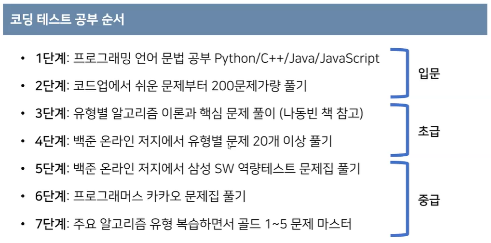
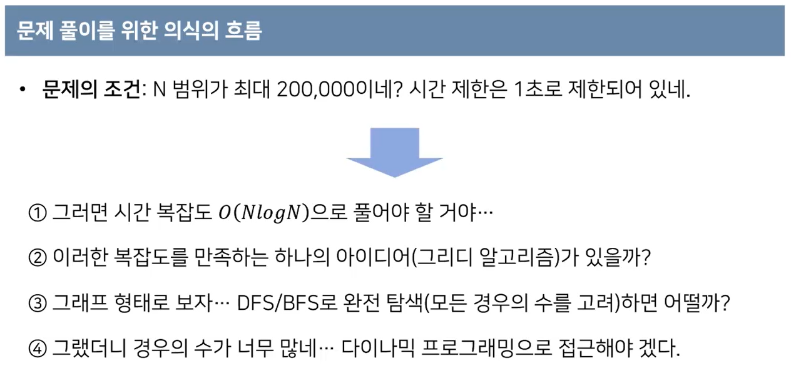
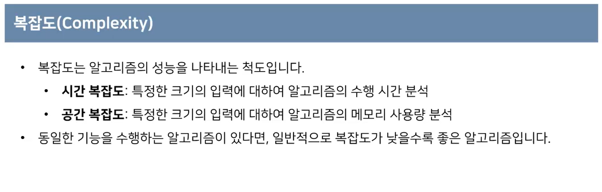
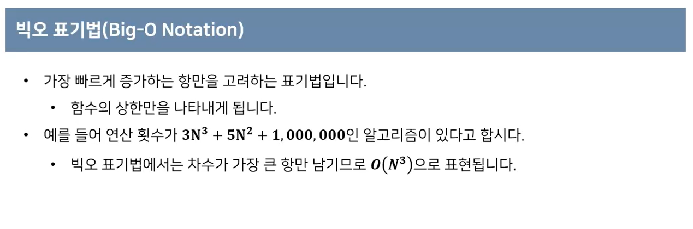
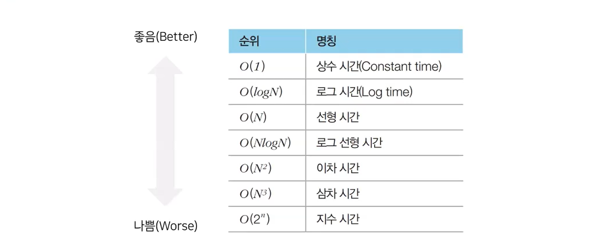
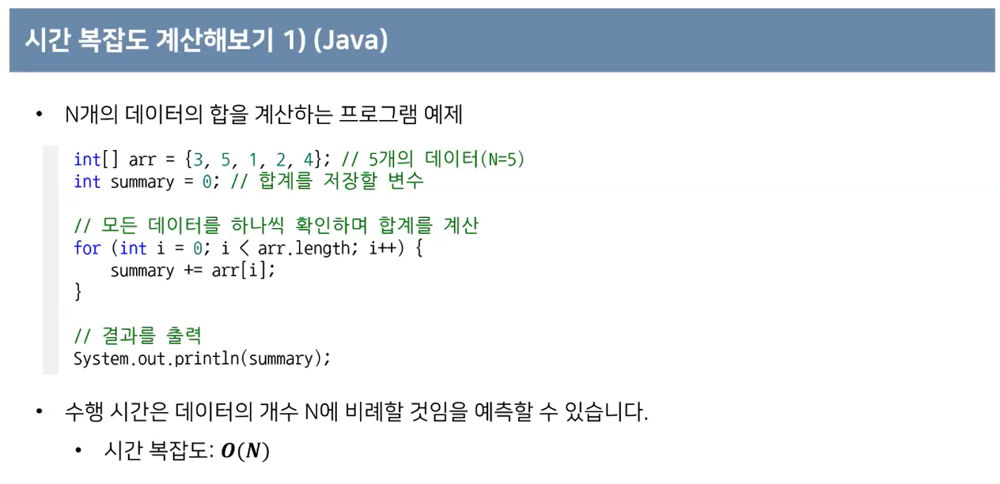
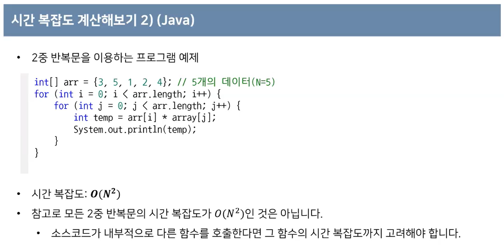
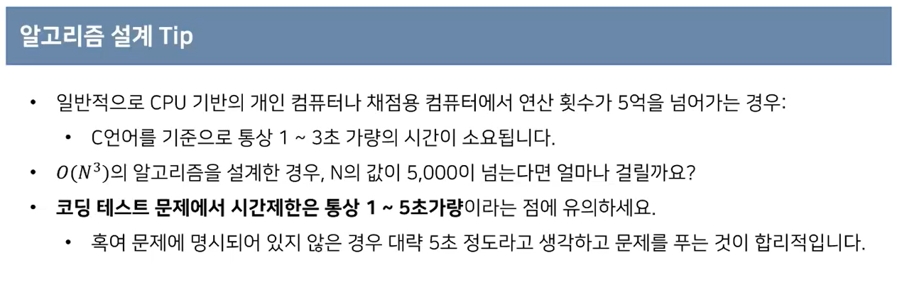
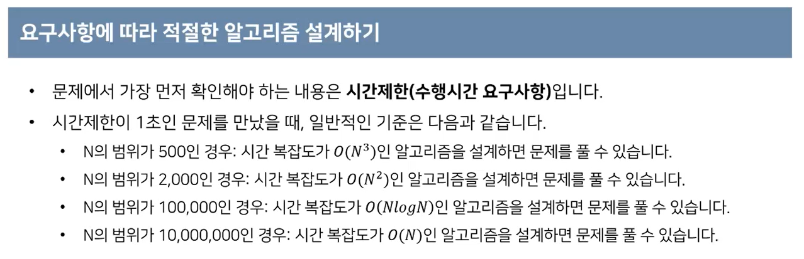
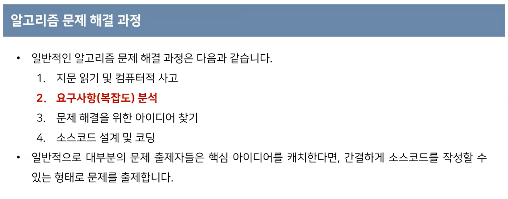

# 코테 특강 1주차

* 백준이나 프로그래머스에서 문제 풀자

### 문제 풀이를 위한 의식의 흐름

* 문제의 조건 : N의 범위가 최대 200,000, 시간 제한 1초
  * 일반적인 PC에서는 1초에 1억번 정도의 연산 가능
  * 그럼 시간복잡도를 보면?
  * N = 10000 일 때 => N^2 = 1억. 간당간당
  * N = 100000 일 때 => N^2 = 100억. 시간초과!! NlogN!!

### 복잡도 (Complexity)

* 시간 복잡도는, 이 알고리즘이 얼마나 오래걸리는지를 함수로 표현하는 것
* 공간 복잡도는, 주 기억장치인 RAM을 얼마나 많이 잡아먹느냐에 대한 내용

### 빅오 표기법(Big-O Notation)

* 통상적으로 우리가 프로그램으로 작성할 때 현실적으로 N^3 보다는 작아야 유용한 프로그램이 된다.

### 시간 복잡도 계산해보기

* N^3일 때 N이 5000만 되어도 125억이 넘는다. 100초정도...
* 그래서 문제 풀 때 시간제한 확인하고, 데이터 N의 개수 확인하고 알고리즘을 역으로 설계하는 것이 일반적인 방법

### 적절한 알고리즘 설계

### 알고리즘 문제 해결 과정

