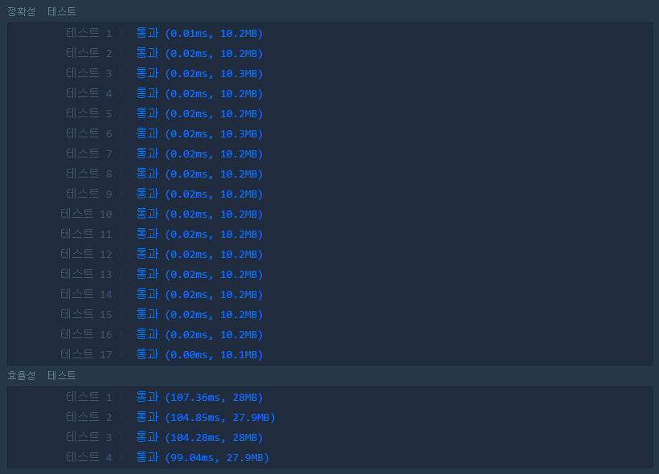
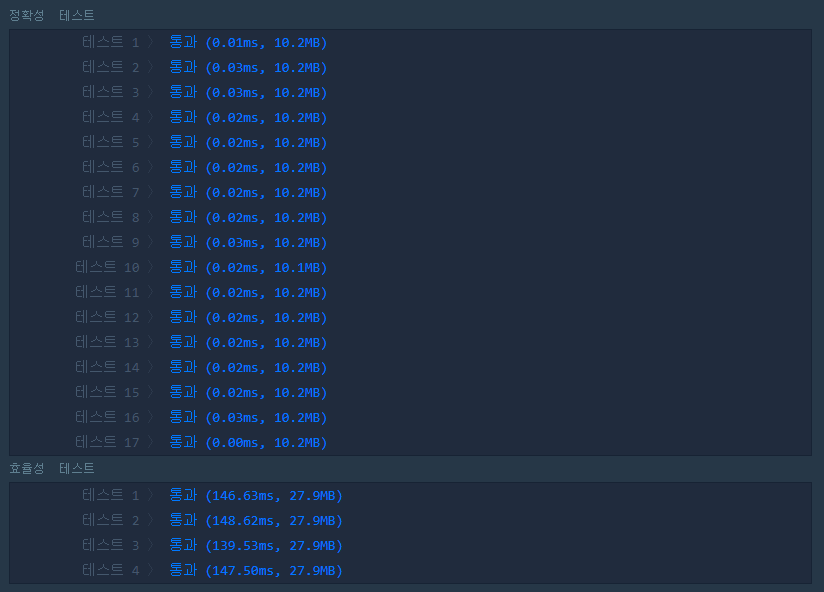

# 같은 숫자는 싫어

<br/>

#### 문제 설명

배열 arr가 주어집니다. 배열 arr의 각 원소는 숫자 0부터 9까지로 이루어져 있습니다. 이때, 배열 arr에서 연속적으로 나타나는 숫자는 하나만 남기고 전부 제거하려고 합니다. 단, 제거된 후 남은 수들을 반환할 때는 배열 arr의 원소들의 순서를 유지해야 합니다. 예를 들면,

- arr = [1, 1, 3, 3, 0, 1, 1] 이면 [1, 3, 0, 1] 을 return 합니다.
- arr = [4, 4, 4, 3, 3] 이면 [4, 3] 을 return 합니다.

배열 arr에서 연속적으로 나타나는 숫자는 제거하고 남은 수들을 return 하는 solution 함수를 완성해 주세요.

<br/>

#### 제한사항

- 배열 arr의 크기 : 1,000,000 이하의 자연수
- 배열 arr의 원소의 크기 : 0보다 크거나 같고 9보다 작거나 같은 정수

<br/>

#### 입출력 예

| arr             | answer    |
| --------------- | --------- |
| [1,1,3,3,0,1,1] | [1,3,0,1] |
| [4,4,4,3,3]     | [4,3]     |

<br/>

#### 입출력 예 설명

입출력 예 #1,2
문제의 예시와 같습니다.

<br/>

#### 내가 작성한 코드

```python
def solution(arr):
    
    while i < len(arr):
        if arr[i-1] == arr[i]:
            arr.pop(i-1)
        else:
            i += 1
        
    return arr
```

* 결과는 맞았으나, 효율성 검사에서 모두 실패!
* 검사해서 이전 요소와 같으면 pop()으로 삭제하는 코드.
* 하지만 매번 len()을 검사해서 연산이 많아져 효율성이 꽝이다.

<br/>

#### 다른 사람 코드를 검색한 후 다시 짠 코드

```python
def solution(arr):
    answer = [arr[0]]
    for i in range(1, len(arr)):
        if arr[i-1] != arr[i]:
            answer.append(arr[i])
        
    return answer
```

* 생각을 달리하게 되었다.
* 기존 배열에서 겹치는걸 '삭제' 하지 말고, 안겹치는걸 '추가' 하면 어떨까?



<br/>

#### 다른 사람이 작성한 맘에 드는 코드

```python
def solution(s):
    a = []
    for i in s:
        if a[-1:] == [i]: continue
        a.append(i)
    return a
```

* 슬라이싱으로 하면 빈 배열의 -1 번째 인덱스를 접근해도 에러가 발생하지 않는다!
* 이미 넣은 배열의 요소와 같으면 패스, 다르면 추가 하는 방식의 간단한 코드.
* 하지만 비교를 위해 매번 요소 하나의 배열을 생성하기 때문에(?)
* ms 차이이긴 하지만.. 내가 짠 코드보다는 아주 조금 성능이 덜한 것 같다. 



<br/>