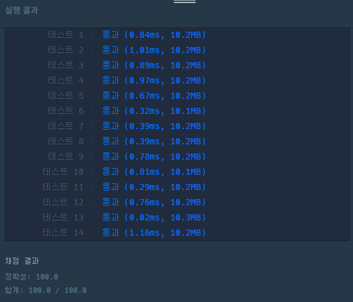

# 서울에서 김서방 찾기

<br/>

#### 문제 설명

String형 배열 seoul의 element중 Kim의 위치 x를 찾아, 김서방은 x에 있다는 String을 반환하는 함수, solution을 완성하세요. seoul에 Kim은 오직 한 번만 나타나며 잘못된 값이 입력되는 경우는 없습니다.

<br/>

#### 제한사항

- seoul은 길이 1 이상, 1000 이하인 배열입니다.
- seoul의 원소는 길이 1 이상, 20 이하인 문자열입니다.
- Kim은 반드시 seoul 안에 포함되어 있습니다.

<br/>

#### 입출력 예

| seoul       | return            |
| ----------- | ----------------- |
| [Jane, Kim] | 김서방은 1에 있다 |

<br/>

#### 내가 작성한 코드

```python
def solution(seoul):
    for i, v in enumerate(seoul):
        if v == "Kim":
            return "김서방은 {0}에 있다".format(i)
```

* 문자열 리스트에서 특정 요소의 인덱스를 찾는 문제.
* enumerate를 이용해 인덱스와 값을 동시에 다루는 형태를 사용하였다.
* 순차적으로 돌면서 값이 존재하면 해당 인덱스를 이용해 바로 return 해버리는 코드


<br/>

#### 다른 사람이 작성한 맘에 드는 코드

```python
def solution(seoul):
    return "김서방은 {0}에 있다".format(seoul.index("Kim"))
```

* 이 방법도 생각했었는데, list의 내장함수로 어떤 함수가 있는지 기억이 잘 나질 않았다.
* find 함수를 생각했는데, 이건 string의 내장함수였고. index 함수를 기억하자.
* 실행 속도는 진짜 Case By Case 여서 뭐가 더 효율적이라고 말하기 어려울 듯.

