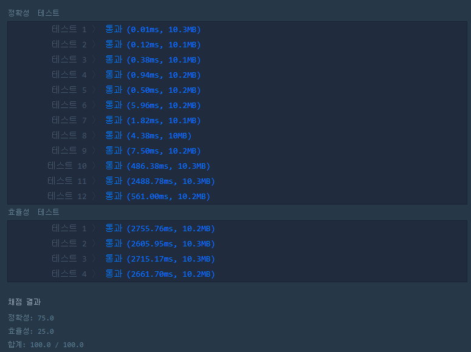
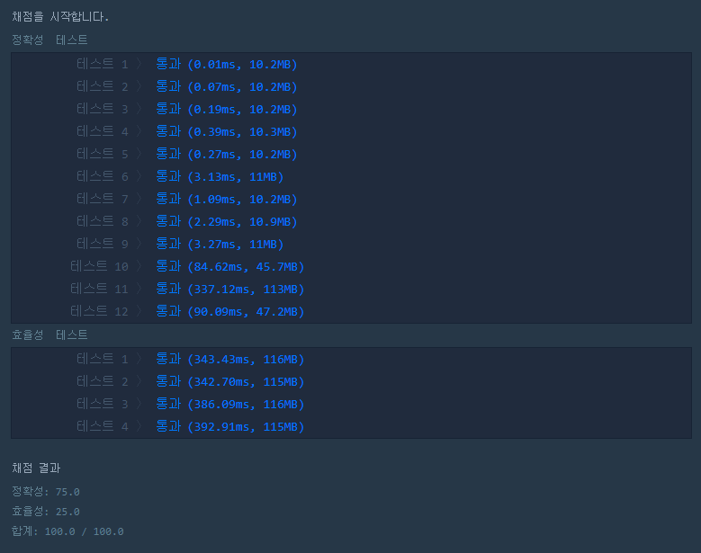
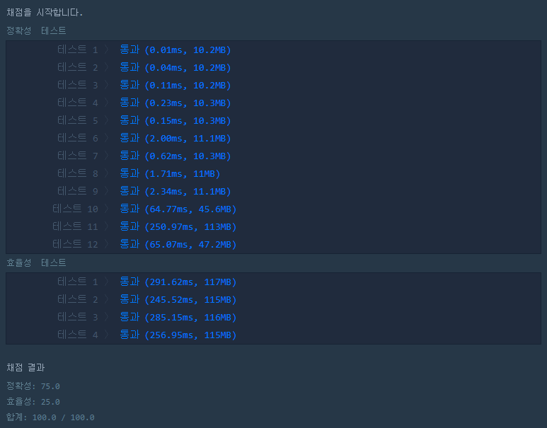

# 소수 찾기

<br/>

#### 문제 설명

1부터 입력받은 숫자 n 사이에 있는 소수의 개수를 반환하는 함수, solution을 만들어 보세요.

소수는 1과 자기 자신으로만 나누어지는 수를 의미합니다.
(1은 소수가 아닙니다.)

<br/>

#### 제한사항

- n은 2이상 1000000이하의 자연수입니다.

<br/>

#### 입출력 예

| n    | result |
| ---- | ------ |
| 10   | 4      |
| 5    | 3      |

<br/>

#### 입출력 예 #1

1부터 10 사이의 소수는 [2,3,5,7] 4개가 존재하므로 4를 반환

<br/>

#### 입출력 예 #2

1부터 5 사이의 소수는 [2,3,5] 3개가 존재하므로 3를 반환

<br/>

#### 내가 작성한 코드

```python
import math
def solution(n):
    answer = 0
    for i in range(2, n+1):
        for j in range(2, int(math.sqrt(i))+1):
            if not i%j:
                break
        else:
            answer+=1;
    return answer
```

* 고전적인 코드. 처음엔 시간초과가 나서 줄이기를 반복했다.
* 소수는 {1, 자신}으로만 나누어지는 수를 말한다.
* 즉, {2, ... n-1} 사이의 숫자로 나누어지면 소수가 아니다. (2는 소수)
* 따라서 이중 포문으로 돌며 나머지 연산 조건문으로 판단한다.
* 하지만 하나하나 다 비교해주므로 시간복잡도는 O(N).


* 이를 줄이고자 2/N 까지만 검사한다.
* N의 가장 작은 약수가 2 이므로.. 그럼 O(N/2)이 된다.
* 그럼 3은? 5는? 7은? 이렇게 하나하나 줄여가는거지... O(N/3), O(N/5), O(N/7)...
* 결국 루트N이 가장 마지노선이 될 것이다.
* N이 될 수 있는 수를 검사하는 중에 검사될 수 있는 가장 큰 숫자는 제곱근이 될 것이다.
* 제곱근 보다 큰 약수가 있으면 당연히 제곱근보다 작은 숫자를 검사할 때 검출 될 테니까.
* 따라서 루트N 까지 검사해주면 시간복잡도는 O(√N)이 된다.
* 효율성 검사 겨우 성공..



<br/>

#### 다른 사람이 작성한 맘에 드는 코드

```python
def solution(n):
    num = set(range(2, n+1))

    for i in range(2, n+1):
        if i in num:
            num -= set(range(i*2, n+1, i)) # 배수 모두 삭제
    
    return len(num)
```

* **에라토스테네스의 체를 이용한 방법!**
* 먼저 2부터 n까지의 수를 num 집합(set)으로 만든다.
* 2부터 n까지 반복문을 돌려서 num에 존재하는 숫자면, 해당 숫자의 모든 배수를 제외한다.
* 반복해서 배수들을 모두 제외하면 소수만 남는다.
* 상단에서 해준 방법보다 더 빠르군



<br/>

#### 응용하여 더 빠른 방법

```python
import math
def solution(n):
    num = set(range(2, n+1))

    for i in range(2, int(math.sqrt(n+1))+1):
        if i in num:
            num -= set(range(i*2, n+1, i)) # 배수 모두 삭제
    
    return len(num)
```

* 그렇다. 효율성을 더 높여보자. 위의 두 코드를 응용하면 이렇게 된다.
* 에라토스테네스의 체를 응용하는 곳에 루트n+1만큼만 수행해주면 연산을 줄일 수 있다.
* 그러면 실행 시간과 효율성도 높아진다! 전체적으로 조금씩 빨라진 것을 확인할 수 있다.

