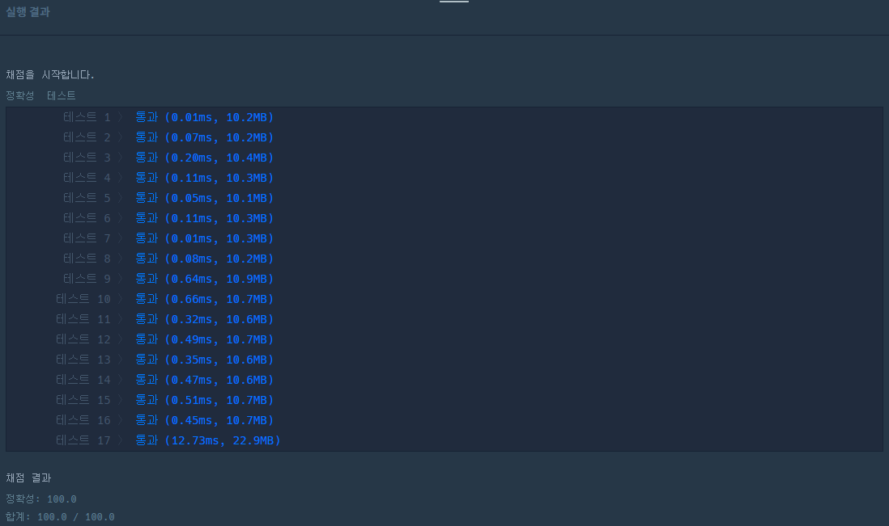

# 행렬의 덧셈

<br/>

#### 문제 설명

행렬의 덧셈은 행과 열의 크기가 같은 두 행렬의 같은 행, 같은 열의 값을 서로 더한 결과가 됩니다. 2개의 행렬 arr1과 arr2를 입력받아, 행렬 덧셈의 결과를 반환하는 함수, solution을 완성해주세요.

<br/>

#### 제한 조건

- 행렬 arr1, arr2의 행과 열의 길이는 500을 넘지 않습니다.

<br/>

#### 입출력 예

| arr1          | arr2          | return        |
| ------------- | ------------- | ------------- |
| [[1,2],[2,3]] | [[3,4],[5,6]] | [[4,6],[7,9]] |
| [[1],[2]]     | [[3],[4]]     | [[4],[6]]     |

<br/>

#### 내가 작성한 코드1

```python
def solution(arr1, arr2):
    for i in range(len(arr1)):
        for j in range(len(arr1[0])):
            arr1[i][j] += arr2[i][j]
    return arr1
```

* 이중 for문을 이용해 arr1에 arr2를 더해서 반환하는 코드

<br/>

#### 내가 작성한 코드2

```python
def solution(arr1, arr2):
    return [[arr1[i][j] + arr2[i][j] for j in range(len(arr1[0]))] for i in range(len(arr1))]
```

* 리스트 컴프리핸션을 이용한 성능 및 간단하게 만든 코드
* 파이썬스럽다.


<br/>

#### 다른 사람이 작성한 맘에 드는 코드

```python
def solution(arr1, arr2):
    return [[a + b for a, b in zip(a1, a2)] for a1, a2 in zip(arr1, arr2)]
```

* 리스트 컴프리핸션에 zip()을 이용해서 같은 인덱스 요소별로 묶어서 더하는 코드
* 위의 경우 arr1, arr2가 2차원 리스트이기 때문에 zip으로 두 번 묶어주었다.
  * 첫 번째 묶을 때는 arr1, arr2 리스트의 요소인 리스트들이 a1, a2로 각각 묶인다.
  * 두 번째 묶을 때는 a1, a2의 같은 인덱스 요소값이 a, b로 묶인다.
  * 이 a, b를 더하면 arr1, arr2의 같은 인덱스ㅔ에 해당하는 값을 더하는 것이 된다.



* 하지만 성능으로 보면 zip()을 사용하지 않고 리스트 컴프리핸션만 쓰는 것이 효율적이다.